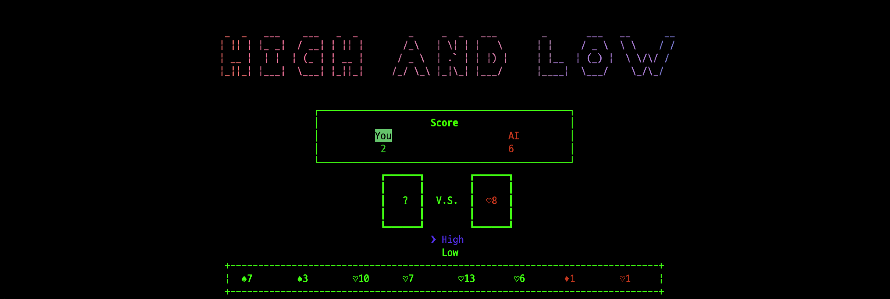

# ONLINE CASINO


## Games

### High and Low



## メモ

```plain
- パッケージ
  - @kamiazya-online-casino/playing-cards
    - 抽象モデル
      - PlayingCardsBase: EventEmitterを継承
        - Card
        - CardCollection: カードがまとまっているもの
          - Hold: 手札
          - Deck: 山札
  - @kamiazya-online-casino/french-suited-deck
    - よく見るスペードとか、クローバーどかののスーツのあるデッキ、カードの具体クラスを提供する
      - モデル
        - FrenchSuitedCard extends Card
          - SuitedCard
            - Spade
            - Club
            - Diamond
            - Heart
          - Joker
        - FrenchSuitedDeck extends Deck
  - @kamiazya-online-casino/high-and-low-game
    - High and Lowゲームの基礎的なところ
    - とりあえず動く
  - @kamiazya-online-casino/cui
    - おまけ
```

## CUI

```bash
yarn install
yarn start
```
